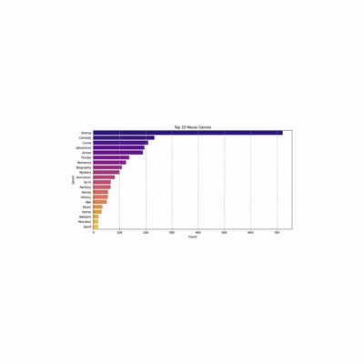
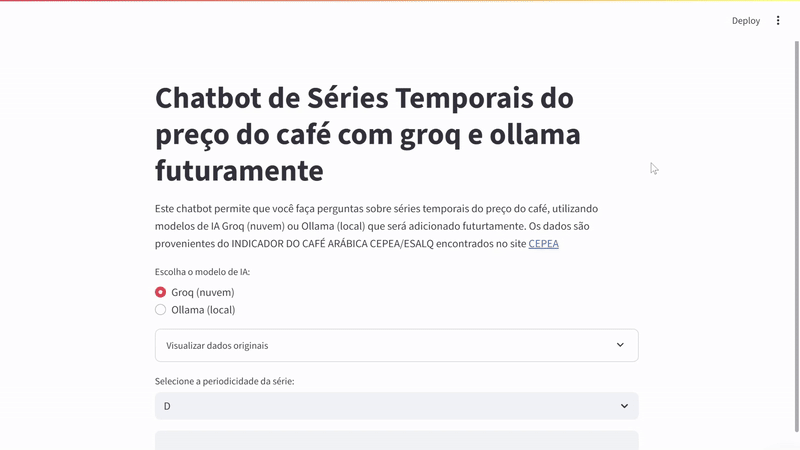

# Meu GitHub

Bem-vindo ao meu perfil no GitHub! Aqui estão alguns dos projetos que estou desenvolvendo e que refletem minha experiência com **Data Science**, **Machine Learning**, e **Computational Mathematics**.

---

## Projetos Destacados
<table width="100%" style="border-collapse: separate; border-spacing: 20px;">
    <tr>
        <td width="50%" style="text-align: center; padding: 10px; background-color: #f8f9fa; border-radius: 10px;">
            
            <h3><a href="https://github.com/KaioBrasildS/LH_CD_KAIOBRASIL" style="text-decoration: none; color: #333; font-weight: bold;">LH_CD_KAIOBRASIL</a></h3>
            
Desenvolvimento de análise e visualização de dados de ranking IMDb de filmes, otimizando decisões.

        </td>
        <td width="50%" style="text-align: center; padding: 10px; background-color: #f8f9fa; border-radius: 10px;">
            <a href="https://github.com/KaioBrasildS/Chatbot" style="text-decoration: none; color: inherit;">
                
                <h3 style="margin-top: 10px; color: #333; font-weight: bold;">Chatbot de Análise de Preços do Café</h3>
                
Chatbot inteligente para análise de preços do café utilizando API da Groq com modelo LLaMA 3.

            </a>
        </td>
    </tr>
</table>

---

## Estatísticas do GitHub

<table width="100%">
  <tr>
    <td width="50%">
      

        
      

    </td>
    <td width="50%">
      

        
      

    </td>
  </tr>
</table>

---

## Habilidades

### Linguagens:
- **Python** (pandas, numpy, scikit-learn, matplotlib, seaborn, streamlit, Pymc)

### Competências Técnicas:
- **Machine Learning**
- **Análise Estatística**
- **Visualização de Dados**
- **Git/Github**
- **MySQL**
- **DuckDB**

---

Se você tiver dúvidas ou sugestões, sinta-se à vontade para entrar em contato! 😊

